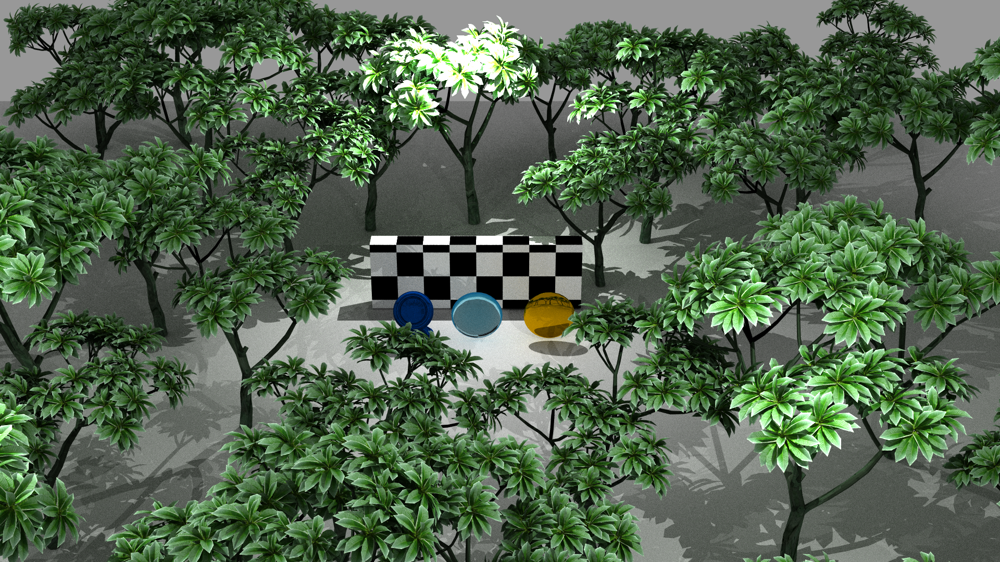

# CPU Path Tracer

This is a CPU path tracer written in C++26. It supports multiple light bounces, multiple materials, importance sampling and multithreaded rendering. Scene representation is JSON and can be imported from Blender. The JSON parser was written from scratch using my own parser generator. Rendering is accelerated with a two-level BVH structure.



## How to use
The renderer accepts json-described scenes. The latter command produces a scene file from a Blender scene.
```
blender <...blend> -b -P export.py 
```

Then you can render the scene with the following command:
```
./main <scene.json> [resolution scale] [samples per pixel] ['a' for the whole animation or anything else for a single frame] [number of threads]
```

The final video file was produced with the following commands:
```
blender project_scene/scene.blend -b -P export.py
./main export.json 1 8 a
```
Note that the number of threads is skipped, meaning the hardware parallelism of the CPU will be used.
